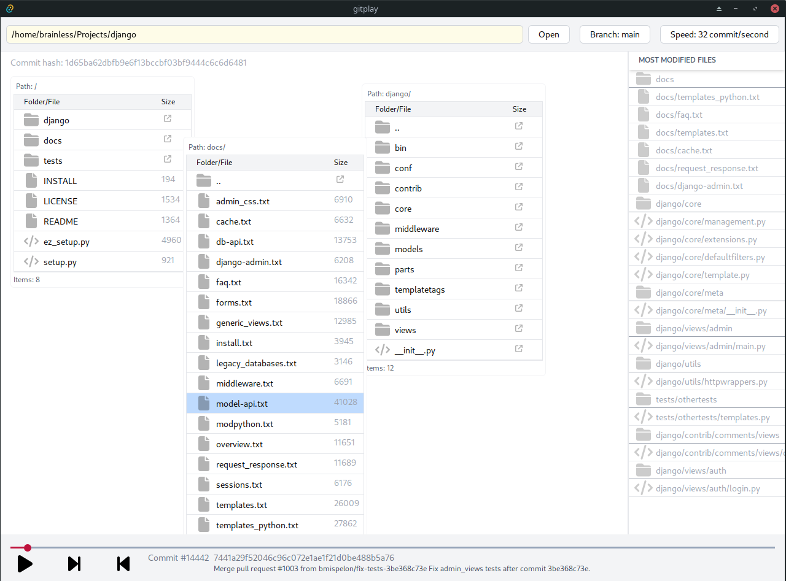

# Welcome to gitPlay!

_Please note_: this product is in very early stage of development and should not really usable yet!

`gitPlay` is a desktop application that you can use to understand the evolution of your software (which uses `git` for version control)

## Who is this for?

If you are a software developer, project manager (for software companies) or are interested in learning about software development, then `gitPlay` is for you.

## How does it work/help?

The `git` repository of any matured software has hundreds or thousands of chunks of history which capture the evolution of that software. Take Django for example, which is a web framework in the Python programming language. Using `gitPlay`, you can deep dive into this rich history of the software, which spans more than 30,000 commits for over a decade, involving contributions from hundreds of individuals across the world.

`Git` stores this history of development in small chunks called `commits`. Commits are a like a snapshot that a developer created of the state of the software at a certain point in time. Commits usually have a comment stating what work was done and a snapshot of the entire file system of that software at the time of the commit. `gitPlay` shows this rich data in a way similar to watching a video - commit by commit. It shows the folders/files structure as they have evolved over time.

## What can I use it for?

If you have a software project version controlled with `git` (either open source or not) you can use `gitPlay` to inspect its evolution. It is intended to be a powerful learning tool for software developers in general or team members in enterprises who have recently joined a project.

## Rough idea of upcoming features

- Show hot spots across the entire file structure in the whole timeline
- See how any file(s) has progressed across time
- Show contributions by time (like in a calendar), overall and by developer
- Search identifiers (class/function names) across the entire history and see their changes/refactors
- Record/play videos describing the history of a repository with anotations that open different commits/files in `gitPlay` for users to easily follow
- Store text anotations explaning the history to help onboard developers to new projects
- Integrate with project management software to overlay tickets with correspond to pull/merge requests (enterprise)
